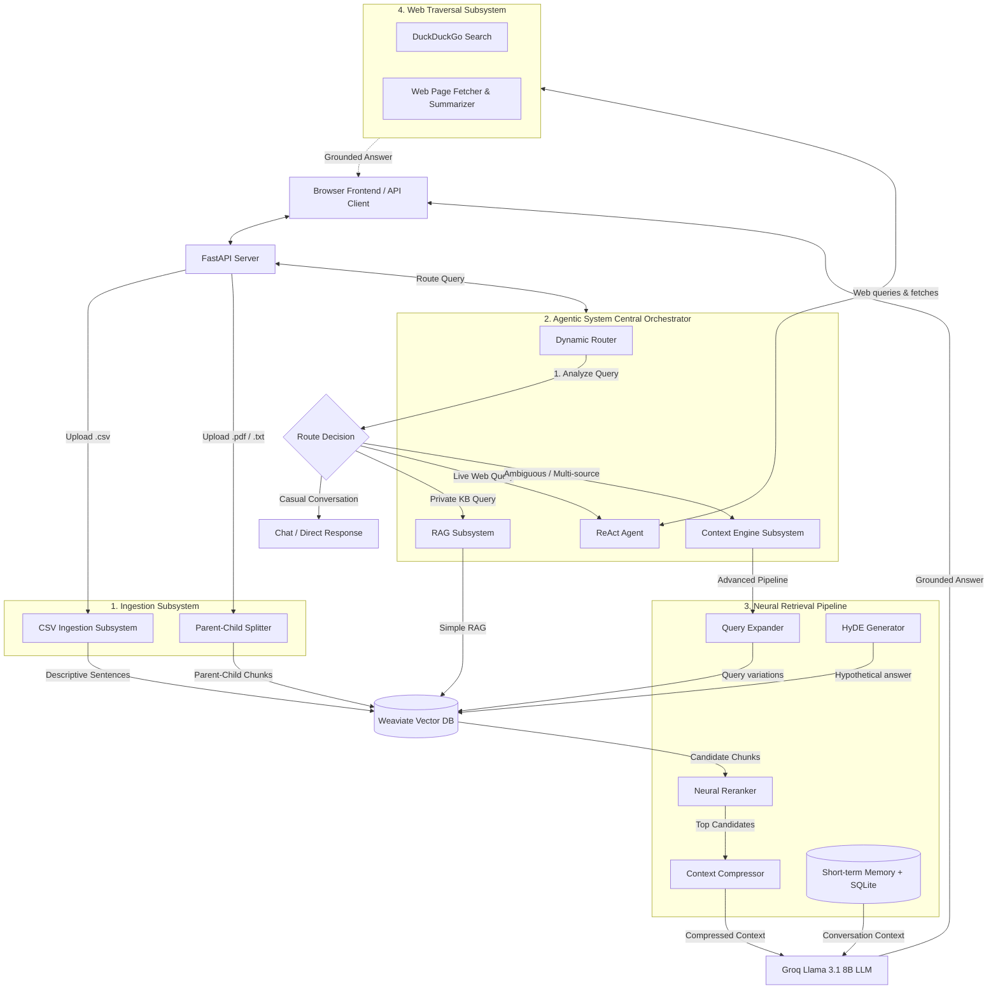

# RAG Context Engine — Architecture & Subsystems Guide

Welcome to the **RAG Context Engine Architecture Guide**! This document provides a beginner-friendly yet detailed overview of how our system operates at the moment.

---

## 1. High-Level Architecture Diagram

The diagram below maps how documents are loaded into the system (Ingestion Flow) and how queries are processed and answered (Query Flow).

---

## 2. System Subsystems Explained

The engine is divided into four main layers:

### A. Ingestion Subsystem
Responsible for parsing documents and saving them in the vector database.
- **CSV Ingestion Subsystem**: When you upload a `.csv` file, the system reads the headers and checks if they match a known e-commerce table (Customers, Products, Orders, Order Items). If so, it translates each row into a descriptive natural language sentence (e.g. `"Customer Jane (ID: 10) resides in New York..."`). This maintains cell relationships. For generic CSVs, it builds structured key-value sentences.
- **Parent-Child Splitter**: When you upload a `.pdf` or `.txt` file, it chunks the document into large **Parent Blocks** (~1500 tokens) for context preservation and smaller overlapping **Child Chunks** (~300 tokens) for precise search.

### B. Dynamic Router Subsystem
An automated dispatch gate. When a user asks a question, the Router classifies the query's intent *before* calling the LLM to save latency and ensure safety:
- **DIRECT / CHAT**: Used for greetings or chit-chat. Bypasses Weaviate to answer directly.
- **KNOWLEDGE_BASE / STRICT_RAG**: Mandates local vector retrieval. Restricts the model from searching the internet to prevent data leaks.
- **WEB**: Invokes the ReAct Agent using live public DuckDuckGo search tools.
- **HYBRID**: Combines local file knowledge with web searches.

### C. Neural Retrieval Pipeline
Coordinates advanced vector search and token compression:
1. **Query Expander**: Generates 3 search variations of the user's question.
2. **HyDE (Hypothetical Document Embeddings)**: Writes a fake, ideal answer to search Weaviate (declarative text matches stored text much better than a question does).
3. **Hybrid Search**: Combines semantic vector similarity with traditional keyword search (BM25).
4. **Neural Reranker**: A Cross-Encoder model (`ms-marco-MiniLM-L-6-v2`) re-scores retrieved chunks to put the most relevant text at the top.
5. **Context Compressor**: Strips out filler sentences and packs the most relevant text to fit within a strict token budget.

### D. ReAct Agent & Web Traversal Subsystem
An autonomous loop that executes when live web research is needed:
- Uses `web_search` and `web_fetch` to search DuckDuckGo and fetch web pages.
- Automatically normalizes page text, strips away ads/formatting, and summarizes long pages.
- Restricts tool permissions dynamically based on the chosen route.

---

## 3. Storage Layer
- **Weaviate Cloud**: Secure vector database that holds child vectors and links them to parent documents.
- **SQLite Database (`memory.db`)**: Local SQL storage that persists session memory. Supports WAL (Write-Ahead Logging) and concurrent transactions.
