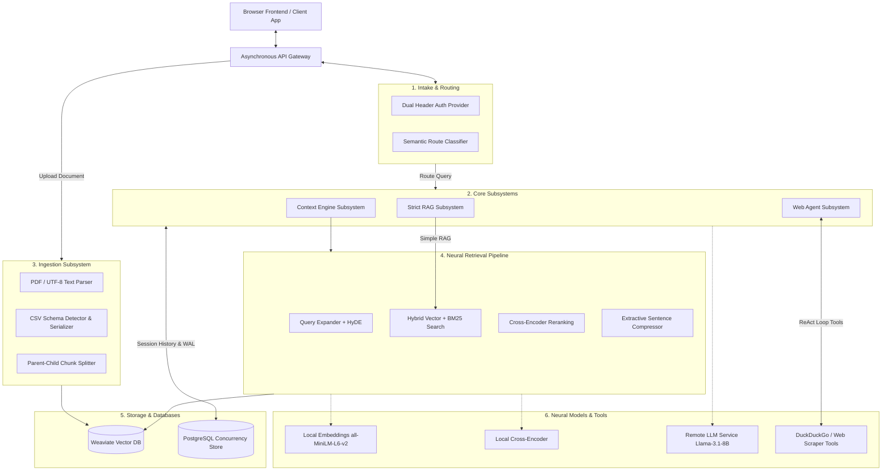
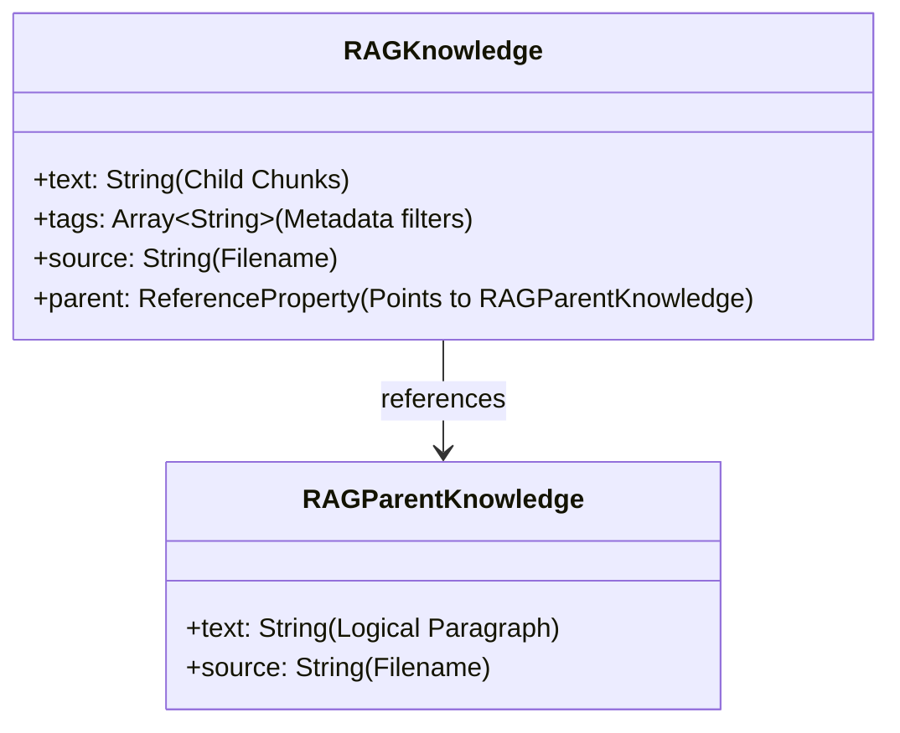

# RAG Context Engine — Pre-Development Design Document (PRD / SDD)

**Project Name**: RAG Context Engine  
**Document Status**: Ideal Target Blueprint (Pre-Development Vision)  
**Target Audience**: Developers, Core Architects, and Engineering Leads  

---

## 1. Executive Summary & Vision

### 1.1 Problem Statement
In enterprise environments, Large Language Models (LLMs) are limited by knowledge cutoffs, hallucinations, and context window restraints. Standard naive RAG systems solve this by feeding raw text snippets into prompt windows. However, this causes:
1. **Loss of Table Structure**: Simple text chunking splits tabular rows and columns, losing relationships between cell entries.
2. **Context Window Contention**: Feeding complete documents exceeds context bounds, driving up API expenses and reducing response precision.
3. **Rigid Query Processing**: A single pipeline cannot efficiently handle simple chat, private document retrieval, and active internet research.
4. **Concurrency Failures**: Traditional local file databases lock up under concurrent multi-user web traffic.

### 1.2 The Ideal Solution
The **RAG Context Engine** is envisioned as a modular, high-concurrency, zero-trust retrieval brain. It dynamically routes user queries through specialized pipelines, parses unstructured texts into semantic parent-child hierarchies, serializes CSV tables into relationship-preserving natural language sentences, reranks search candidates using neural models, compresses retrieved contexts to fit strict token envelopes, and manages session history with mathematical temporal decay.

---

## 2. Product Requirements Document (PRD)

### 2.1 Functional Requirements

#### F1: Intelligent Intent Routing
- **Envisioned Behavior**: The system must automatically classify query intent *before* execution:
  - **`CHAT`**: Greetings or general context-free conversational queries.
  - **`STRICT_RAG`**: Queries requiring private vector document lookup. Internet access is blocked to prevent data leakage.
  - **`WEB_AGENT`**: Queries requiring real-time public data. Activates an autonomous search agent.
  - **`HYBRID`**: Merges local knowledge base results with live public web sources.
- **Ideal Implementation**: Routing must be determined by a **lightweight semantic classifier** (e.g., a tiny fine-tuned classifier or structured LLM tool-call output) rather than fragile, hardcoded list-based keyword matching.

#### F2: Universal Document Ingestion Subsystem
- **Unstructured Files (PDF/TXT)**: Split documents into hierarchical structures:
  - **Parent Chunks** (~1500 tokens) representing complete, boundary-aware logical paragraphs.
  - **Child Chunks** (~300 tokens) with a 50-token overlap for hyper-specific semantic search.
- **Structured CSV Tables**: Maintain tabular cell relationships. The system must parse CSVs, identify primary schemas (e.g., Customers, Products, Orders), and serialize each row into a descriptive sentence before vectorizing.
- **Ideal Implementation**: Rather than manual column matching, the system should use a **schema mapping registry** or an LLM-assisted schema auto-detector to convert structured rows into semantic sentences.

#### F3: Advanced Context Assembly
- **Query Expansion**: Automatically rewrites short queries into 3 semantic variations to maximize database coverage.
- **HyDE (Hypothetical Document Embeddings)**: Generates a hypothetical ideal answer to use as the search vector (semantic match on declarative statements is more accurate than query questions).
- **Dynamic Hybrid Search Tuning**: Shifts hybrid search weights towards BM25 keyword matching (`alpha=0.2`) when technical terms or error codes are detected, and towards semantic matching (`alpha=0.5`) for natural language.
- **Neural Reranking**: Re-evaluates top search results using a local Cross-Encoder model.
- **Context Compression**: Extracts and packs the most relevant sentences into a strict token budget.

#### F4: Mathematical Session Memory
- **Temporal Decay**: Automatically weights memory entries using an exponential decay function so that recent turns carry more weight, but critical old context is preserved.
- **Chronological Restructuring**: Sorts active memory chunks chronologically before prompt injection so the LLM receives a coherent conversation history.

---

## 3. System Design Document (SDD)

### 3.1 Target Architecture Diagram



---

### 3.2 Ideal Database Design

#### A. Vector Database (Weaviate Class Schema)
To achieve precise semantic targeting without losing document context, Weaviate stores child chunks linked to parent documents:



#### B. Relational Database (Session Memory & Telemetry Store)
To avoid the database lock-ups common in SQLite when multiple clients read/write concurrently, the ideal design uses a production database (e.g., PostgreSQL) with an asynchronous connection pool, storing detailed prompt telemetry:

```sql
CREATE TABLE sessions (
    session_id VARCHAR(64) PRIMARY KEY,
    created_at TIMESTAMP DEFAULT CURRENT_TIMESTAMP
);

CREATE TABLE memory_logs (
    id SERIAL PRIMARY KEY,
    session_id VARCHAR(64) REFERENCES sessions(session_id) ON DELETE CASCADE,
    role VARCHAR(16) NOT NULL, -- 'user' or 'assistant'
    text TEXT NOT NULL,
    importance DOUBLE PRECISION DEFAULT 1.0,
    timestamp TIMESTAMP DEFAULT CURRENT_TIMESTAMP,
    input_tokens INT,
    output_tokens INT,
    latency_ms DOUBLE PRECISION,
    query_cost NUMERIC(10, 6),
    routing_decision VARCHAR(32),
    raw_prompt TEXT
);

CREATE INDEX idx_memory_session_time ON memory_logs (session_id, timestamp);
```

---

### 3.3 Target Algorithms Specification

#### 1. Layout-Aware Parent-Child Splitter
Instead of dividing text blindly by characters or sentences, the splitter parses documents into structural nodes (titles, headers, lists, paragraphs):
- **Step 1**: Extract document hierarchy using document structure analysis (e.g., Markdown headers or PDF page bounding boxes).
- **Step 2**: Store whole structural sections as **Parent Blocks** (max 1500 tokens).
- **Step 3**: Slice parent blocks into overlapping **Child Chunks** (300 tokens, 50 overlap) to generate embedding vectors.
- **Query Resolution**: The retriever searches Child Chunks, but returns the linked Parent Blocks to the LLM to supply complete, grammatically sound context.

#### 2. Dynamic CSV Schema Ingestion
Rather than hardcoding CSV column signatures, the engine reads incoming columns and maps them dynamically:
```
Inputs: CSV Row, Column Headers
Output: Descriptive Semantic Sentence

Let Headers = Column Names
Let RowValues = Row Values
Let SchemaMatch = Registry.Match(Headers)

If SchemaMatch exists:
    Generate formatted string using pre-defined Template[SchemaMatch]
Else:
    Generate formatted string: "Record has fields: Header1 = Value1, Header2 = Value2..."
```
This ensures that column-row relationships are vectorized as a single semantic entity.

#### 3. Temporal Memory Decay
Conversation memory fades mathematically to simulate focus, reducing prompt size:
$$\text{Weight} = \text{Importance} \times e^{-k \times \Delta t}$$
Where:
- $k$: Decay constant (default `0.1`).
- $\Delta t$: Time elapsed in hours.
- Active memory instances are pruned if $\text{Weight} < 0.1$.
- Prior to formatting the prompt, remaining memory blocks are sorted chronologically.

#### 4. Structured ReAct Tool Execution Loop
Instead of parsing raw LLM text with fragile regex patterns and executing auto-correction loops, the agent uses structured tool calls (e.g., JSON schemas):
1. **Structured Output**: The agent generates a structured JSON object specifying `tool_name` and `arguments`.
2. **Strict Parser**: The engine validates the JSON against a Pydantic schema. If invalid, it rejects it immediately, feeding the JSON validation error back to the model.
3. **Execution**: Once validated, the selected tool runs synchronously under strict execution timeouts.

---

## 4. API Interface Specification

### 4.1 `/upload` [POST]
Accepts a document and indexes it into the vector store.
- **Request (Multipart Form-Data)**: `file: UploadFile`
- **Security**: Requires a valid `X-API-Key` or `Authorization Bearer` token.
- **Validation**: Rejects files > 10MB; validates file header signatures (magic bytes) to prevent executable upload exploits.

### 4.2 `/query` [POST]
Performs a synchronous query on the RAG pipeline.
- **Request (JSON)**:
  ```json
  {
    "question": "What is the order date for customer ID 12?",
    "session_id": "session-456",
    "mode": "context_engine",
    "source_filter": "orders.csv",
    "context_limit": 4096
  }
  ```
- **Response (JSON)**: Returns the generated answer, source references, compression stats, routing diagnostics, and query telemetry.

### 4.3 `/query_stream` [POST]
Streams the query response using Server-Sent Events (SSE).
- **Request (JSON)**: Same as `/query`.
- **Response (`text/event-stream`)**: Streams structured JSON chunks indicating state changes:
  - `data: {"event": "routing_decision", "route": "STRICT_RAG"}`
  - `data: {"event": "document_retrieval", "count": 5}`
  - `data: {"event": "answer_chunk", "text": "The "}`
  - `data: {"event": "usage", "cost": 0.00015}`

---

## 5. Technology Stack Recommendations

- **API Layer**: FastAPI + Gunicorn (with Uvicorn workers for high concurrency).
- **Database Layer**: Weaviate Cloud (v4 Client) for vector indexes + PostgreSQL (with connection pooling) for session persistent memory.
- **Local Embedding Engine**: SentenceTransformers running locally on dedicated hardware/CPU.
- **LLM Engine**: Groq Cloud REST client for low-latency generation.
- **Structured Schema Validator**: Pydantic or Instructor for agent tool validation.

---

## 6. Pre-Development Verification Blueprint

To verify the system during initial development, execute the following matrix:

| Test Type | Target Component | Success Criteria |
|---|---|---|
| **Unit Test** | Hierarchical Splitter | Verifies that child chunks are bounded by paragraph limits and maintain absolute reference links back to parent blocks. |
| **Unit Test** | Temporal Memory Decay | Verifies that historical conversation weights decay over mock time offsets, sorting results chronologically. |
| **Integration Test** | Structured Ingestion | Confirms that uploading a CSV produces populated schemas in Weaviate, preserving rows as single vectors. |
| **Integration Test** | Concurrency Pool | Executes 20 parallel query requests to verify database connection pooling without transaction locks. |
| **Manual Test** | System Dashboard | Confirms that inputting keys updates dashboard metrics, and stats updates dynamically reflect queries. |
