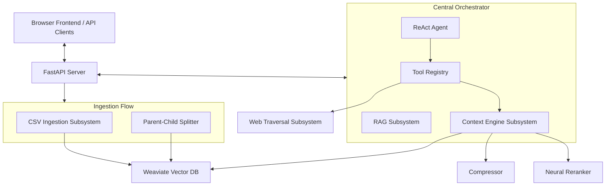

# Subsystems Architecture and Capabilities Report

This report documents the architectural improvements, capabilities, and design patterns introduced to the RAG Context Engine. By refactoring the codebase into modular subsystems, the engine now boasts production-ready reliability, precise information retrieval, secure access controls, and web-traversal autonomy.

---

## 1. Subsystems Architecture

The system has transitioned from a monolithic design into a decoupled, subsystem-based layout under the main orchestrator, `AgenticSystem`:

### Key Modules:
- **`RAGSubsystem`**: Serves standard, flat Retrieval-Augmented Generation. Used for simple queries where low latency is preferred over complex context optimization.
- **`ContextEngineSubsystem`**: Serves advanced, query-expanded, re-ranked, and token-compressed retrieval. It provides the high-level `retrieve_and_compress()` interface to the ReAct agent loops.
- **`AgenticSystem`**: Bridges memory, persistence, models, the ReAct Agent, and the execution pipeline.
- **`CSV Ingestion Subsystem`**: Parsed row-by-row structure matching. Dynamically auto-detects column schemas (Customers, Products, Orders, Order Items) or falls back to key-value maps to serialize tabular rows to sentence embeddings.
- **`Parent-Child Splitter`**: Partitioning engine for PDF/TXT files, splitting documents into boundary-aware parent chunks and overlapping child chunks.

---

## 2. Parent-Child Chunking Subsystem

To maximize Weaviate retrieval precision without diluting LLM generation context, we implemented **Parent-Child Chunking**:

1. **Splitting Mechanics (`ParentChildSplitter`)**:
   - **Parent Blocks**: Splits documents into parent blocks of ~1500 tokens, respecting paragraph (`\n\n`) and sentence (`. `) boundaries.
   - **Child Blocks**: Splits each parent into child chunks of ~300 tokens using a sliding token window with a 50-token overlap.

2. **Weaviate Schema Organization**:
   - `RAGParentKnowledge`: Stores the parent chunks (`text`, `source`).
   - `RAGKnowledge`: Stores the child chunks and vectors, referencing the parent collection via a cross-reference link (`parent`).

3. **Resolving References at Query Time**:
   - The retriever queries Weaviate using the child chunks (which have high semantic specificity).
   - Upon matching a child, the retriever resolves the `parent` cross-reference and retrieves the larger 1500-token parent block to assemble the context, providing the LLM with complete paragraphs for coherent text generation.

---

## 3. Web Traversal Subsystem (`core/web_traversal.py`)

The agent is empowered with autonomous web search and navigation capabilities through two core modules:

### A. Web Search (`search_web`)
- Integrates with DuckDuckGo Lite via a robust `POST` request mechanism to prevent redirects and rate-limiting blocks.
- Uses optimized regex patterns to extract search results, parsing titles, links, and snippets cleanly.
- Standardizes output schemas to return uniform `{title, url, snippet}` result sets.

### B. Web Page Fetching & Clean-up (`fetch_web_page`)
- **Noise Stripping**: Automatically strips out non-content HTML elements: `<script>`, `<style>`, `<nav>`, `<header>`, `<footer>`, `<aside>`.
- **URL Resolution**: Uses `urljoin` to resolve relative hyperlinks into absolute links, allowing the agent to crawl recursively.
- **Text Normalization**: Standardizes whitespace, decodes HTML entities, and truncates text to fit within token budgets.

### Agent Tool Integration:
Exposed as two distinct tools in [agent_tools.py](file:///c:/Users/vasan/Documents/Apphelix%20Intern/RAG/core/agent_tools.py):
- `web_search`: Query search engines.
- `web_fetch`: Download and clean up raw page text.

---

## 4. API Authentication & Security Subsystem

We locked down all REST endpoints (`/query`, `/query_stream`, `/upload`, `/stats`, `/history/{session_id}`) with dual security headers:

### Backend Security (`verify_api_key`)
- Supports both standard Bearer tokens (`Authorization: Bearer <key>`) and custom headers (`X-API-Key`).
- **Live Diagnostics**: Logs incoming authentication checks immediately to the console and log files (`logs/rag_engine.log`), including representation dumps (`repr(token)`) to make troubleshooting trailing spaces or key mismatches transparent.

### Frontend Key Entry & UX Polish
- **Visibility Toggle**: Added an inline show/hide button (eye icon) inside the password field so users can inspect pasted keys.
- **Debounced Validation**: Implemented a `300ms` debounce on key typing to prevent spamming stats verification checks and avoid concurrent request race conditions.
- **Race Condition Guard**: Integrated `AbortController` sequencing on stats polls, so out-of-order asynchronous responses never corrupt the connection status dot.
- **Visual Feedback**: Styles the input border instantly: **green** for successful validation and **red** for invalid keys.
- **Dynamic Thread Restoration**: Instantly restores conversation history (`loadHistory()`) as soon as a valid key is provided, eliminating the need to refresh the page.

---

## 5. Tabular Data & CSV Ingestion Subsystem

The system incorporates a structured ingestion subsystem for tabular data uploaded via the `/upload` API or dashboard interface:

### A. Dynamic Schema Auto-Detection
- When a `.csv` file is uploaded, the backend checks for column signature matches against our core e-commerce database tables:
  - **Customers**: Requires `customer_id`, `customer_name`, and `email`.
  - **Products**: Requires `product_id`, `product_name`, and `category`.
  - **Orders**: Requires `order_id`, `customer_id`, `order_date`, and `shipping_cost`.
  - **Order Items**: Requires `order_item_id`, `order_id`, `product_id`, and `total_price`.
- If a CSV doesn't match any schema, the subsystem falls back to a **generic CSV mapper** that builds key-value lists for each row.

### B. Natural Language Serialization
- Standard text splitters split tabular data at arbitrary lines and characters, losing columns and context. To prevent this, the subsystem translates each row of the CSV into a coherent, descriptive sentence. E.g.:
  - Customer row → `"Customer John Doe (ID: 12) has email john@doe.com. Resides in New York..."`
  - Product row → `"Product Widget (ID: 55) is in category Electronics. Unit price: $49.99..."`
- This ensures the neural embedding models (`all-MiniLM-L6-v2`) capture complete record relationships semantically.

### C. Vector Chunking Integration
- Each serialized row description is stored as a single parent-child chunk pair `(text, [text])` in the `RAGParentKnowledge` and `RAGKnowledge` collections.
- This bypasses character-based sentence splitting entirely and loads the entire record intact, providing optimal query-to-answer relevancy when the LLM reads retrieved context.
